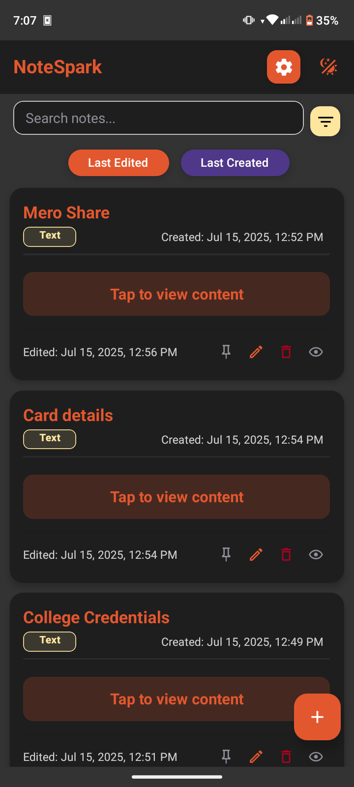
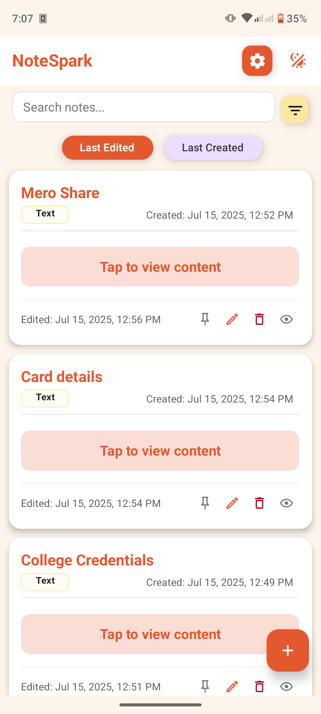
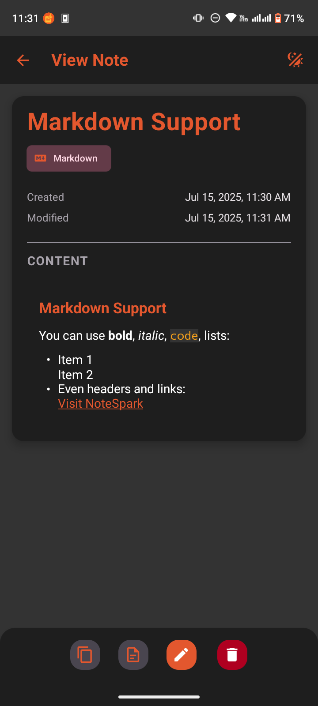
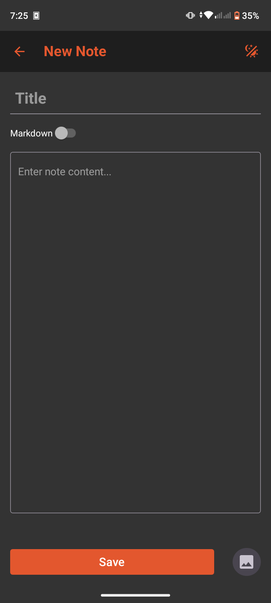
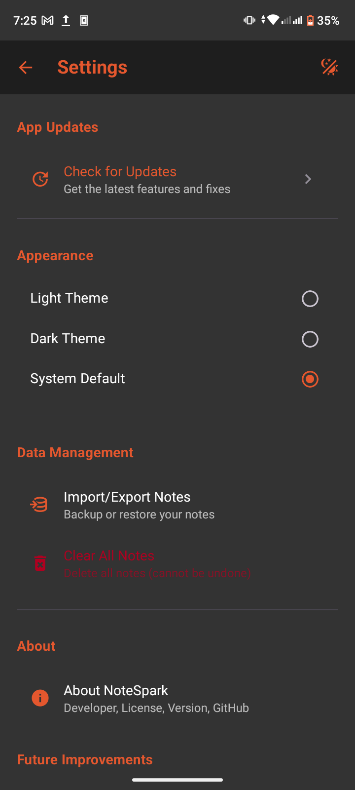
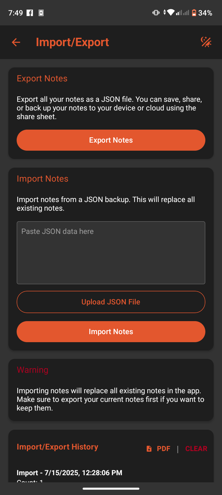

  

# 🔥 NoteSpark

  
  
  
  
  
  

  <b>NoteSpark</b> is a fast, offline-first notes and ideas app built with Expo, React Native, and TypeScript. 
  <i>Speed, simplicity, and privacy — no internet required, no accounts, no ads. Just pure note-taking joy.</i>

---

## 📦 Download

You can download NoteSpark from:

- [SourceForge (latest version)](https://sourceforge.net/projects/notespark/files/latest/download)
- [GitHub Releases (ZIP file)](https://github.com/Lusan-sapkota/NoteSpark/releases)

> **Landing page:** [notespark.lusansapkota.com.np](https://notespark.lusansapkota.com.np) will be live soon!  
> Once live, it will offer a high-speed download option for NoteSpark.

---

## ✨ Features

- ✍️ **Create, edit, and delete notes** — Simple, fast, and intuitive note management.
- � **Markdown-ready** — Write notes in Markdown with live preview and formatting.
- ↕️ **Sort & filter** — Sort by last edited or created, and filter by type or content instantly.
- 🔍 **Advanced search** — Instantly find notes by title, content, or type with blazing speed.
- � **Pin notes** — Pin your most important notes to always keep them at the top.
- 🖼️ **Image support** — Attach images to your notes (stored as file links).
- 🔗 **Link & media detection** — Auto-detects and highlights links, supports clickable URLs and media.
- 📝 **Rich text & plain text** — Switch between Markdown and plain text modes anytime.
- 🕒 **Timestamps** — See when notes were created and last edited.
- 🌙 **Beautiful UI & Dark Mode** — Minimal, modern design with full dark mode support.
- ⚡ **Blazing fast** — Instant launch and navigation, even with hundreds of notes.
- 🔒 **Fully offline** — All notes are stored locally. No internet required.
- 🛡️ **Privacy-first** — No accounts, no tracking, no ads. Your notes never leave your device.
- �️ **Import/Export** — Backup and restore your notes easily.
- 🗂️ **Import/Export history** — View past import/export actions, download history as PDF, or clear records.
- 🧭 **Easy navigation** — Clean navigation and search for quick access to your ideas.
- 📋 **Copy & share** — Copy note content or share with other apps easily.
- 🔔 **Notification system** — Get notifications from the app.
- 🛠️ **Open source** — GPLv3 licensed, contributions welcome!

---

## 🚀 Tech Stack

- [Expo](https://expo.dev/)
- [React Native](https://reactnative.dev/)
- [TypeScript](https://www.typescriptlang.org/)
- [React Native Paper](https://callstack.github.io/react-native-paper/)
- [AsyncStorage](https://react-native-async-storage.github.io/async-storage/)

---

## 📸 Demo

  <table>
    <tr>
      <td></td>
      <td></td>
      <td></td>
    </tr>
    <tr>
      <td></td>
      <td></td>
      <td></td>
    </tr>
  </table>

---

## 🤝 Contributing

Pull requests, bug reports, and feature suggestions are welcome! Please open an issue or PR on GitHub.

---

## 📄 License

This project is licensed under the GPLv3 License. See [LICENSE](./LICENSE) for details.

## ☄️ Future imporvements

- PERSONAL VAULT
- NO-CLOUD SYNC
- WEB INTRACTION
- TWO WAY SYNC

> Ensuring your data always stays in your devices

## 🧑‍💻 Developer

This project is made and maintained by Lusan Sapkota.

- **GitHub:** [Lusan-sapkota](https://github.com/Lusan-sapkota)
- **Email:** [sapkotalusan@gmail.com](mailto:sapkotalusan@gmail.com)